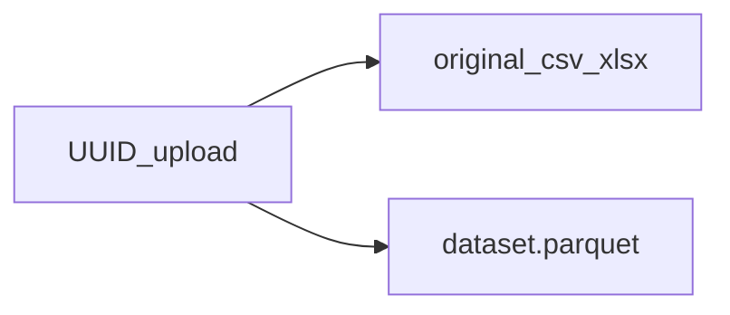

# Backend — Análisis al Instante

Servicio **FastAPI** que recibe hojas de cálculo, genera un perfil con **pandas**, solicita sugerencias JSON a **Gemini** y persiste el dataset en **Supabase Storage** (original + Parquet) con metadatos en **Postgres**.

## Stack y decisiones

| Elección | Motivo |
| --- | --- |
| **FastAPI + Pydantic** | Contratos explícitos (`/docs` OpenAPI), validación de payloads y manejo cómodo de `multipart/form-data`. |
| **pandas + pyarrow** | Parseo `.csv` / `.xlsx`, `describe` y export Parquet liviano para reuso en agregaciones. |
| **Gemini (`google-genai`)** | SDK oficial ([`google-genai`](https://github.com/googleapis/python-genai)); `client.models.generate_content` con modelo configurable por alias (véase siguiente sección). |
| **Supabase** | El Parquet en Storage + fila en `uploads` permiten reiniciar el backend sin perder el último dataset asociado al `upload_id`. |

## Modelos Gemini compatibles (`GEMINI_MODEL`)

El id se pasa tal cual al método `generate_content` del cliente (véase [modelos Gemini API](https://ai.google.dev/gemini-api/docs/models)).

| Valor recomendado (por defecto en código) | Uso típico |
| --- | --- |
| **`gemini-2.5-flash-lite`** | Variante más **económica y rápida** de la familia 2.5 (recomendada en plan gratuito). |
| `gemini-2.5-flash` | Más capacidad que *flash-lite*, algo más cara en uso de cuota según cuenta. |
| `gemini-2.0-flash` | Generación anterior; puede tener **cuotas distintas** respecto a 2.5 (útil solo si necesita ese id en su proyecto). |

Puede cambiar `GEMINI_MODEL` en `.env` y reiniciar Uvicorn; no hace falta tocar código.

Si ese modelo agota **cuota o límite de peticiones**, el backend **prueba automáticamente** otros ids en cadena (variantes económicas primero: `gemini-2.5-flash-lite`, `gemini-2.0-flash`, `gemini-2.5-flash`; luego modelos más potentes como `gemini-2.5-pro` y `gemini-3-pro-preview` si existen para su clave). Un id que no exista para el proyecto se omite y se sigue con el siguiente. Solo si **todos** fallan por cuota, la ruta `/api/analyze` responde **429**.

## Variables de entorno

Copie [.env.example](.env.example) a `.env` y complete:

- `GEMINI_API_KEY` — clave de Google AI Studio / Vertex según su proveedor.
- `GEMINI_MODEL` — por defecto `gemini-2.5-flash-lite` (ver tabla arriba; lista oficial en la [documentación de modelos](https://ai.google.dev/gemini-api/docs/models)).
- `SUPABASE_URL`, `SUPABASE_SERVICE_ROLE_KEY` — **solo servidor**; jamás en el bundle de React.
- `SUPABASE_BUCKET` — nombre del bucket (por defecto `uploads`).
- `CORS_ORIGINS` — orígenes permitidos separados por comas (p.ej. `http://localhost:5173`). Vacío en desarrollo: se permiten `http(s)://localhost` y `http(s)://127.0.0.1` en cualquier puerto.

## Base de datos y Storage (Supabase)

1. Cree un proyecto en Supabase.  
2. **Storage**: bucket privado llamado `uploads` (o el valor de `SUPABASE_BUCKET`).  
3. **SQL** (editor SQL):

```sql
create table public.uploads (
  id uuid primary key,
  original_path text not null,
  parquet_path text not null,
  suggestions jsonb not null default '[]'::jsonb,
  created_at timestamptz not null default now()
);

alter table public.uploads enable row level security;

-- El cliente Python usa la service role key, que ignora RLS en la práctica.
-- Mantenga políticas estrictas si algún día expone la tabla al anon key.
```

### Objetos almacenados



Rutas objeto: `{upload_id}/original.{ext}` y `{upload_id}/dataset.parquet`.

## Endpoints

| Método | Ruta | Descripción |
| --- | --- | --- |
| `POST` | `/api/analyze` | `multipart/form-data` con campo `file` (`.csv` o `.xlsx`). Devuelve `upload_id` + `suggestions[]` (`title`, `chart_type`, `parameters`, `insight`). |
| `POST` | `/api/charts/series` | JSON `{ "upload_id", "chart_type", "parameters" }`; devuelve filas ya agregadas listas para Recharts. |

## Ingeniería de prompts

- **Rol**: analista de datos senior.  
- **Entrada**: texto compacto derivado del DataFrame (`build_data_frame_profile`): filas/columnas, `dtypes`, `numeric_describe`, **`categorical_nunique` por columna no numérica** dentro del alcance del perfil, y `categorical_top_values` (muestra acotada) para las primeras columnas categóricas.  
- **Elegibilidad de gráficas** (instrucciones al modelo): barras solo si la categoría en el eje X tiene `categorical_nunique` ≤ 15; pie solo si ≤ 8; líneas con eje X temporal u ordenado; dispersión solo con dos columnas numéricas reales.  
- **Salida esperada**: arreglo JSON **únicamente** (sin Markdown) de **3 a 5** objetos. Claves obligatorias: `title`, `chart_type ∈ {bar,line,pie,scatter}`, `parameters` (referencias a columnas reales usando `x_axis` / `y_axis` cuando aplique), `insight` (español).  
- **Reintento**: hasta dos llamadas al modelo cuando hace falta ajustar el JSON (`generate_chart_suggestions`).

## Ejecución local

Desde la carpeta **`backend-dashboard-creator`** (donde está este `README` y el `venv`):

```powershell
cd backend-dashboard-creator
.\venv\Scripts\Activate.ps1
pip install -r requirements.txt
```

```powershell
uvicorn main:app --reload --host 0.0.0.0 --port 8000
```

Abra la documentación interactiva con Swagger en `http://localhost:8000/docs`.

### Comprobaciones rápidas

1. Ejecutar `POST /api/analyze` con un CSV de prueba desde `/docs`.  
2. Copiar `upload_id` + una `suggestion` y llamar `/api/charts/series`.  